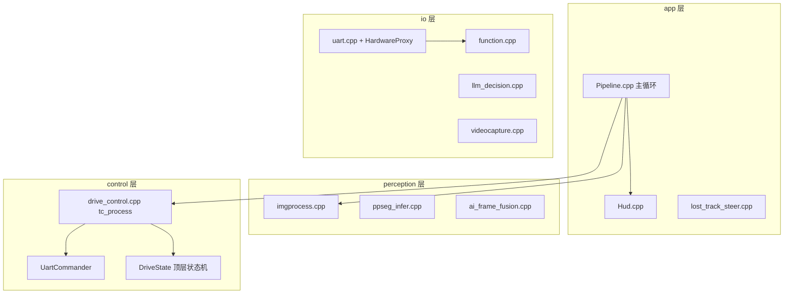

# Xcar2 项目导读（给 AI 助手）

本文档帮助 AI 助手快速理解 Xcar2 工程（实际目录 `/home/orangepi/Desktop/Xcar`）的结构、数据流和修改边界。**修改代码前请先读对应模块章节，避免误改串口时序或状态机优先级。**

**下位机契约**（TC264 固件行为、双向 cmd 语义、状态机）：见 [`TC264.md`](TC264.md)。固件源码在独立仓库 `D:\MySpace\TC264`。


**当前比赛规则**：以组委会公开发布的区域赛现场比赛手册 V3.0（2026.07）为准。规则全文若在本地保存，请勿在未确认转载许可前提交到公开仓库。

---

## 1. 项目是什么

**Xcar2** 运行在 **Orange Pi（RK3588）** 上的智能车视觉循迹主程序：

- 摄像头帧来自共享内存 **`shm_ar_video`**
- **RKNN NPU** 跑 YOLO（金币/车/人/警告路牌）
- **PPSeg** 做赛道边界与中线（`perception/`）
- **`control/drive_control.cpp`**：顶层 `DriveState` + 各元素子状态机 + 引导曲线
- **`UartCommander`**：离散下行指令的**唯一出口**（统一去重）
- **UART** 连接 TC264（`/dev/my_tc264`）；**`HardwareProxy`** 后台收编码器/yaw，可选转发 UDS

主可执行文件：`build/bin/main`（CMake target `main`）。入口 `src/main.cpp` 仅调用 `runPipeline()`，主循环在 `src/app/Pipeline.cpp`。

日常整车由 `/home/orangepi/Desktop/run_all.sh` 启动：脚本先在主程序所在目录启动 `build/bin/main`，等待 2 秒后启动定位程序 `Position/slam_workspace/slam_all/build/robot_core`。主程序自身不再依赖脚本的 `cd`：配置、模型、录像目录和配置写回均由 `include/app/resource_paths.h` 基于可执行文件位置解析，并以编译期工程根目录作为后备。

| 模式 | `configs/config.json` → `app.runtimeMode` |
|------|-------------------------------------------|
| `vision` | 显示窗口、调试 HUD、可录像 |
| `race` | 无显示；**要求 UART 可用**（否则退出） |

`race` 模式每帧监控 UART 发送统计；连续 3 个比赛帧出现发送失败时先尝试下发保护停车，再输出一次性 fatal 并退出主循环。

### 1.1 V3.0 规则对项目的约束

- 排名先比较完成圈数，再比较净胜时间；稳定完成三圈是最高目标。
- 每圈有 6 个隐藏穿越面，至少通过 5 个并穿过拱门才算有效圈。金币拉线不能以漏过合理赛道路径为代价。
- 碰撞行人/车辆 `+20s/次`，路牌导航错误 `+30s/次`，金币 `-3s/枚`。控制优先级因此保持：安全避让和路牌决策高于金币。
- 第二、三圈各出现一个路牌，两次决策中恰好一次直道、一次岔道，先后顺序每次发车随机；不能按固定圈数或位置硬编码方向。
- 赛道和现场实体固定，随机性集中在路牌岔道顺序，可针对固定赛道调参，但禁止固定时序/位置触发元素处理。
- 红绿灯任务已全面移除；限速牌和 STOP 地标不作为比赛元素处理。STOP 仅在上位机估算第 3/4 圈保留严格大面积遮挡保护：当地标遮盖赛道时显示 `STOP OCCLUDE` 调试标志，屏蔽几何分岔检测/补线；若 PPSeg 有效行过少，则抑制误进 `RETURN_TRACK`，Err 复用上一帧有效控制误差，不停车、不 OCR、不补线。
- 正式发车后禁止 SSH、远程读写和参数修改，`race` 模式必须完全自主运行。
- 摄像头必须平视前方、高度不超过 15cm；偏装时须在裁判 setup UI 中填写位姿补偿，避免 AR 对象叠加偏移。
- 目标检测/OCR须使用飞桨技术路线，VLM/Agent 须使用文心大模型，边缘计算平台为 RK3588；模型转换与 RKNN 部署过程应在技术报告中可复现。

---

## 2. 分层架构

```
app/          主循环编排、HUD 绘制
control/      顶层 DriveState、元素子状态机、UartCommander
perception/   赛道边界/分岔、PPSeg、检测补偿、相机模型
io/           串口协议、ODOM、录像、配置、LLM、共享内存取帧
Uart/         uart.hpp、HardwareProxy.hpp（头文件；实现见 io/uart.cpp）
AI/           RKNN 模型、PPOCR（体积大，少改逻辑）
```



---

## 3. 目录结构

```
Xcar/                              # 实际目录；产品/分支名称仍为 Xcar2
├── src/
│   ├── main.cpp                    # 薄入口：runPipeline()
│   ├── app/
│   │   ├── Pipeline.cpp            # ★ 主循环：采帧→AI→金币映射→感知→控制→下发→HUD/录像
│   │   ├── Hud.cpp                 # HUD 绘制（含 STATE / CAR 0x02 / ODOM / YAW）
│   │   ├── sign_llm_requests.cpp   # SIGN 多 session LLM pending request 管理
│   │   └── lost_track_steer.cpp    # 丢线后按蓝箭头记忆方向/累计 yaw 兜底转向
│   ├── control/
│   │   ├── drive_control.cpp       # ★ tc_process：DriveState + 元素子状态机 + 引导线
│   │   ├── sign_strategy.cpp       # SIGN 反向补全与固定方向解析
│   │   └── UartCommander.cpp       # ★ 离散下行指令唯一出口（0x02/0x03/0x08/0x09/0x0B…）
│   ├── perception/
│   │   ├── imgprocess.cpp          # 边界/中线、TrackRoadMode、分岔几何
│   │   ├── ppseg_infer.cpp         # PPSeg RKNN
│   │   ├── ai_frame_fusion.cpp     # AI 结果按 fid/时间戳对齐及短时运动预测
│   │   ├── ocr_feed_sample.cpp     # SIGN 源帧、ROI 与 frame owner 原子锁存
│   │   ├── sign_ocr_aggregator.cpp # SIGN 多次 OCR 候选聚合、纠错与决策门槛
│   │   └── camera_model.cpp        # 相机模型（像素↔地面）
│   └── io/
│       ├── uart.cpp                # ★ 协议、CRC、RX 解析、odomOnUart* 累计
│       ├── function.cpp            # 录像、Catmull-Rom、ODOM 累计
│       ├── videocapture.cpp        # ShmCapture
│       ├── terminal_output.cpp      # 统一终端输出契约
│       ├── llm_decision.cpp        # 路牌 → LLM → FORK
│       └── config.cpp              # configs/config.json
├── include/
│   ├── app/resource_paths.h         # 工程资源统一路径解析（不依赖 cwd）
│   ├── control/
│   │   ├── drive_state.h           # enum DriveState、tc_currentDriveState()
│   │   ├── sign_strategy.h         # SIGN 策略纯逻辑
│   │   └── uart_commander.h        # UartCommander 单例
│   ├── app/
│   │   ├── pipeline.h              # runPipeline()
│   │   ├── hud.h                   # HUD 绘制 API
│   │   ├── sign_llm_requests.h     # SIGN LLM pending request API
│   │   └── lost_track_steer.h      # LostTrackSteer：丢线方向记忆
│   ├── trackcontrol.h              # tc_process / ControlResult / TrackedObject
│   ├── imgprocess.h, config.h, …
├── Uart/
│   ├── uart.hpp
│   └── HardwareProxy.hpp             # 后台 UART + UDS；encoder_sample_seq 去重
├── common/include/ipc_messages.hpp   # EncoderPacket / ControlPacket
├── configs/config.json               # ★ 运行时配置
├── AI/                               # RKNN 模型、PPOCR（体积大，少改逻辑）
├── test/                             # 场景单测（fork/ped/gold/sign/lost_track 等）
├── Xcar2.md                          # 本文档（AI 助手导读）
├── README.md                         # 简要说明
└── TC264.md                          # 下位机契约
```

业务逻辑集中在 **`src/app/` + `src/control/` + `src/perception/` + `src/io/`**；勿随意改 `AI/` 第三方 OCR 内核。

---

## 4. 单帧主数据流

```
ShmCapture.read(shared frame owner, fid, timestamp) [io/videocapture.cpp]
    ↓
rknnPoolExecutor async latest-waiting-task（等待队列最多 1 帧）
    ↓ 每帧 drain 结果，保留源 fid / 时间戳 / clean frame owner
ai_frame_fusion::Matcher（默认严格窗口 3 帧 / 80ms）
    ↓ EXACT / PREDICTED；首次失配 HELD 一帧，连续失配转 UNMATCHED
vector<TrackedObject> + source fid（SIGN 不预测，OCR 只裁同源帧）
    ↓ tc_applyGoldMappedCenter（金检测框映射脚点）[include/trackcontrol.h]
tc_prepare_frame_detections / tc_apply_fork_scan_bias
    ↓
processFrame → CenterLineResult                 [perception/imgprocess.cpp]
    ↓
tc_process(...) → ControlResult                 [control/drive_control.cpp]
    ↓  内部：各元素子状态机并行更新 → 选出 DriveState → 引导线/速度模式
UartCommander.sendError(0x01)                  [每帧，流式不去重]
UartCommander 事件发 0x02/0x09/0x0B…          [状态型，统一去重]
HardwareProxy 后台收 0x01/0x02/0x03 → ODOM / tc264_yaw
显示 HUD（STATE + CAR 0x02）、录像             [app/Hud.cpp / Pipeline.cpp]
```

**图像坐标**：原点左上，**y 向下增大**（越大越“近”）。

---

## 5. 顶层状态机（DriveState）

定义见 [`include/control/drive_state.h`](include/control/drive_state.h)。每帧在 `tc_process` 末尾根据各子状态机推断当前主导状态，HUD 顶栏显示 `STATE: ...`（`drawDriveStateHud`）。

**优先级**（靠前绝对优先）：

```
LAUNCH > AVOID_PED > AVOID_CAR > FORK_DECIDE > FOLLOW_GOLD
       > RETURN_TRACK > LEAVING_CAR > FAST_BACK
       > STABLE_SPEED > NORMAL
```

| DriveState | HUD 显示 | 含义 |
|------------|----------|------|
| `Normal` | NORMAL | 纯循迹 |
| `Launch` | LAUNCH | 发车后等待赛道有效行恢复；仅 HUD 显示，不下发 `0x09` |
| `FollowGold` | FOLLOW_GOLD | 金币拉线（可能 0x02=4/6 金币减速） |
| `AvoidCar` | CLOSING_CAR | 车辆绕行，保持 `cmd02=0` 正常模式 |
| `LeavingCar` | LEAVING_CAR | 车辆绕行结束后，按里程保持已选边界循迹 |
| `ReturnTrack` | RETURN_TRACK | 看不到赛道/有效行过少，cmd02=5 兜底返回 |
| `FastBack` | FAST_BACK | 赛道可见但 y=`carTrackRelationY` 原始中线 error 判断车已离道，cmd02=7 |
| `StableSpeed` | STABLE_SPEED | 本车在赛道内且无金币、行人、车辆、路牌处理，cmd02=8 稳定加速 |
| `AvoidPed` | AVOID_PED | 行人避让（停车 / 绕行） |
| `ForkDecide` | FORK_DECIDE | 警告路牌 OCR→LLM→分岔 |

**注意**：各元素**子状态机仍每帧并行更新**（行人 `PedAvoidPhase`、车辆 `AvoidState`、金币锁定、sign OCR/LLM）。`DriveState` 只表达“当前由谁主导引导线与速度模式”，不是互斥替换全部子状态。

### 5.1 引导线优先级（与 DriveState 一致）

```
LAUNCH > 行人 / 车辆拉线 > 路牌决策 > 金币 > RETURN_TRACK
       > LEAVING_CAR > FAST_BACK > STABLE_SPEED/NORMAL 纯循迹
```

---

## 6. UartCommander（离散指令唯一出口）

**所有状态型下行指令必须经 `UartCommander`**，禁止在业务代码中直接 `Uart::instance().send(0x02/0x03/0x07/0x08/0x09/0x0B, ...)`。

| 方法 | cmd | 说明 |
|------|-----|------|
| `sendError(float)` | 0x01 | **每帧**，流式，不去重 |
| `setMotionMode(mode)` | 0x02 | 0 NORMAL / 1 STOP / 2 FAST / 3 SLOW / 4 GOLD_SLOW / 5 RETURN_TRACK / 6 GOLD_BAND / 7 FAST_BACK / 8 STABLE_SPEED |
| `setProtect(v)` | 0x03 | 1 保护停；0 清除 |
| `startCar()` | 0x03,0→0x02,0→0x05,1 | 发车序列（force 绕过去重） |
| `setCurveFlag(v)` | 0x07 | 0/1 弯道标志 |
| `setMaxSpeed(v)` | 0x08 | 最大速度接口仍保留；当前比赛元素中限速牌已删除 |
| `sendStateFlag(flag)` | 0x09 | 顶层 `DriveState` 上报；有效值 1..9，与 HUD 状态同步，按枚举值去重；`Launch=10` 仅 HUD 不下发 |
| `setForkDir(dir)` | 0x0B | 0 none / 1 left / 2 right |
| `emergencyProtect()` | 0x03,1 | 强制保护停 |
| `reset()` | — | tc_init / tc_reset 时清去重记忆 |

底层仍由 `Uart::instance().send()` 写串口；`UartCommander` 只做**去重与语义封装**。

---

## 7. 检测类别

| class_id | 宏 | 含义 |
|----------|-----|------|
| 0 | `GOLD` | 金币 |
| 1 | `CAR` | 车辆 |
| 2 | `HUMAN` | 行人 |
| 3 | `SIGN` | 警告路牌 |

限速牌、交通灯、STOP 地标已从当前比赛逻辑中删除；旧文件/接口若仍存在，仅作兼容或离线回退。STOP 视觉只在上位机估算第 3/4 圈作为严格遮挡保护信号，避免大面积地标遮挡赛道时误触发几何分岔/补线，或因 rows 过低误触发 `RETURN_TRACK`；保护帧 Err 复用上一帧有效控制误差。

---

## 8. 配置系统

- 全局：`config()` → `{ .img, .tc, .app, .camera }`
- 加载：通过 `appResourcePath("configs/config.json")` 基于可执行文件位置解析；不依赖启动时工作目录
- 默认值：`include/config.h`，JSON 覆盖

### `tc` 常用键

| 键 | 用途 |
|----|------|
| `errorCalcY` | 循迹误差采样行 |
| `stableSpeedErrorCalcY` | `STABLE_SPEED` 独立误差采样行；赛道内金币仍可拉线，但金币 y 不再改变该状态的误差采样行 |
| `workZoneHalf` | 工作区半高 |
| `elementYFilterEnabled` / `elementControlMinY` / `signControlMaxY` | 元素统一 Y 门控；开启后 GOLD/CAR/HUMAN 只处理锚点 y 大于 `elementControlMinY` 的目标，SIGN 只处理中心 y 小于 `signControlMaxY` 的目标。金币用映射点，车辆用中心点，行人用脚点 |
| `personAvoidMinY` | 行人深度区 Y 阈值 |
| `personStopReleaseConfirm` | 赛道内行人 STOP 后，确认“远离赛道”的不同新 AI 源帧数；实现至少取 3 帧 |
| `personAwayMinGrowthRatio` | 赛道内行人脚点外侧净空相对同行赛道宽度的最小净增长；当前 `0.04` |
| `personDetourFastConfirm` | 绕行方向锁定后，有效拉线连续确认多少个新 AI 源帧才进入 FAST；当前 `2` |
| `carAvoidMinY` / `avoidOffsetCar` / `carAvoidBoundaryOffset` / `carAvoidLostMax` | 车辆避让；`carAvoidBoundaryOffset` 为选中边界向赛道外侧的偏移量 |
| `carLeavingDistM` | 车辆绕行结束后的已选边界循迹保持里程；当前配置 0.7m |
| `goldFollowMinY` / `goldXMin` / `goldXMax` | 金币参与拉线的 y/x 门限 |
| `goldMinBoxDiag` | 金币检测框左上到右下长度过滤阈值；长度 `<=` 该值不进入拉线/减速 |
| `goldMappedYHeightRatio` / `goldMappedYOffset` | 金币纵向裸映射使用底部接地点锚定；公式为 `mapped_y = box.y + goldMappedYHeightRatio * box.height + goldMappedYOffset`，默认 `1.10 / 0` |
| `goldTrackWidthAddInner` / `goldTrackWidthAddOuter` | 金币赛道内/外扩展带宽 |
| `goldReachableWidthAddOuterLeft` / `goldReachableWidthAddOuterRight` | 橙色边界带之外，金币可参与拉线的左/右赛道边界独立最远外扩宽度 |
| `goldReachableBypassMinY` / `goldReachableBypassMinX` / `goldReachableBypassMaxX` | `RETURN_TRACK` 期间金币兜底可达窗口；映射点 y 大于 MinY 且 x 落在 `[MinX, MaxX]` 时允许拉线并按赛道外金币进入 `GOLD_SLOW` |
| `goldTrackGuidanceWeightRef` / `goldOutsideGuidanceWeightRef` | 金币拉线权重参考距离：三个区域都使用 `w=clamp(1-abs(dx)/weight_ref,0.20,1.0)`，赛道内/边界带取 Track 权重，赛道外取 Outside 权重 |
| `goldLostMax` | 金币丢失帧 |
| `carTrackRelationY` / `carTrackInsideErrorMin/Max` | 用指定行原始中线 error 判断 FAST_BACK |
| `signCenterXOffsetPx` | SIGN 靠近阶段的横向循迹目标偏移；`target_x = sign_box_center_x + offset`，正数向路牌右侧偏 |
| `signOcrMinChars` / `signOcrValidSamples` | OCR 候选最少字符数与中等置信候选稳定次数 |
| `signOcrMinScore` / `signOcrHighScore` | 聚合器最低强证据分数与单次高分直接放行阈值 |
| `signOcrMaxAttempts` | 单个 SIGN OCR 窗口最大尝试次数；到上限且已有候选时必须进入决策 |
| `signOcrIntervalSec` / `signOcrLostTimeout` | OCR 最小间隔与路牌丢失后的状态超时 |
| `signFixedDirectionEnabled` | 是否固定发车后第一次、第二次独立 SIGN 遭遇的进入方向；默认 `false`，开启后优先级高于补全、OCR 与 LLM |
| `signFirstDirection` / `signSecondDirection` | 前两次 SIGN 的固定方向，只接受小写 `straight` 或 `right`；无效值仅令对应次回退普通 OCR 流程 |
| `signComplementStrategyEnabled` | 是否记录首个 SIGN 最终方向，并对第二个 SIGN 执行一次性反向决策；默认 `false` |
| `signComplementMinScore` | 第二个 SIGN 反向触发的严格置信度阈值；默认 `0.85` |

### `app` 常用键

| 键 | 用途 |
|----|------|
| `runtimeMode` | `vision` 调试或 `race` 比赛模式 |
| `aiThreadNum` | YOLO 异步 worker 数量；当前推理固定使用异步 latest-result 路径 |
| `aiNpuCoreStart` | YOLO worker 起始 NPU 核编号，worker 按可用核心轮转 |
| `debugOverlay` | 画面调试叠加总开关；`true` 显示辅助线、状态 HUD、检测框、AI/EVID/ROAD/TRACK/TRACK_REL/ODOM/YAW 等调试信息，`false` 时只显示干净画面 |
| `captureReadTimeoutMs` | 主循环等待共享内存新帧的最长时间，默认 `5ms`；调小可减少 `top=capture` 的单帧阻塞，但不会提高相机/生产端帧率 |
| `perfHudEnabled` | 性能 HUD 开关，仅在 `debugOverlay=true` 时显示；内容包括总帧耗时、最慢模块、有效行数、状态号和 capture/ai/track/tc/ocr/uart/display/key 分段耗时；`track` 还拆分为 `pp`(PPSeg 总耗时)、`rk`(RKNN inputs/run/outputs)、`post`(RKNN 外围 CPU 处理)、`cl`(mask 闭运算)、`bd`(边界扫描)、`core`(分岔/中心线主体)、`fin`(road/filter/clone 收尾) |
| `aiConfThreshold` | YOLO 原始后处理阈值，默认 `0.35`，限制为 `0.05..0.95` |
| `aiFusionMaxFidDiff` / `aiFusionMaxTimeDiffMs` | 当前帧匹配 AI 的严格窗口，默认 `3` 帧 / `80ms` |
| `aiFusionPredictMaxTimeMs` / `aiFusionBufferSize` | 最大预测时间与历史缓存，默认 `80ms` / `8` |
| `aiSourceDrivenControlEnabled` | 默认 `true`，AI 离散控制状态只由未消费的新源帧推进；`false` 回退逐控制帧更新 |
| `aiSourceExitConfirmFrames` | 退出 AI 高影响模式所需的不同新源帧缺失确认数，默认 `2`，最小 `1` |
| `signOcrSourceMaxAgeMs` | SIGN 同源 clean frame 最长 OCR 提交时间，默认 `400ms` |
| `ocrDrainPerFrame` / `ocrCountEmptyAsAttempt` | 每控制帧最多拉取 OCR 结果数，以及空识别是否计入尝试 |
| `ocrDetThreshold` / `ocrBoxThreshold` / `ocrDbUnclipRatio` | PPOCR 检测后处理阈值与 DB 扩框比例 |
| `ocrRecScoreThreshold` / `ocrContextRecScoreThreshold` | 强证据与上下文证据的识别分数阈值 |
| `ocrCropExpandRatio` / `ocrMinBox*` / `ocrMaxBoxRatio` | OCR 文本框扩展与尺寸/宽高比过滤 |
| `ocrContrast*` / `ocrMaxQueueSize` | ROI 对比度增强和 OCR 等待队列上限 |

**注意**：`configs/config.json` 的 `app` 可能含 LLM 密钥，勿提交/复制到文档。

---

## 9. 串口协议（上位机 ↔ 下位机）

完整双向语义见 [`TC264.md`](TC264.md) §5–7。协议与 `Xcar/` **完全一致**，未改动。

### 9.1 帧格式

- **460800 8N1**，固定 **9 字节**，`len=4`，CRC16-CCITT 覆盖前 7 字节
- **`send_raw`** 始终 `datasend[2]=param1_longest_byte`（4），uint8 命令也发满 4 字节 payload

### 9.2 上位机 → 下位机（TX）

| cmd | 含义 | Xcar2 发送位置 |
|-----|------|----------------|
| `0x01` | 横向 **error** | `UartCommander::sendError()`，Pipeline 每帧 |
| `0x02` | 运动模式 | `UartCommander::setMotionMode()` |
| `0x03` | 保护 | `UartCommander::setProtect()` / `emergencyProtect()` |
| `0x04` | 蜂鸣器兼容通道 | 当前业务不发送；底层协议解析保留 |
| `0x05` | **发车** | `UartCommander::startCar()` 内 |
| `0x07` | 弯道标志 | `UartCommander::setCurveFlag()` |
| `0x08` | **max_speed** | `UartCommander::setMaxSpeed()`，当前限速牌元素已停用 |
| `0x09` | 顶层 `DriveState` flag | `UartCommander::sendStateFlag()`；有效值 1..9，与 HUD 状态同步，按枚举值去重；`Launch=10` 仅 HUD 不下发 |
| `0x0B` | 分岔方向 | `UartCommander::setForkDir()` |

**键盘（vision 模式，Pipeline.cpp）**：

| 键 | 动作 |
|----|------|
| `f` | `UartCommander::startCar()` |
| `s` / `q` | `UartCommander::emergencyProtect()` |
| `t` | 开关 TrackControl |
| `r` | 开关录像 |

### 9.3 下位机 → 上位机（RX）

| cmd | 数据 | 上位机处理 |
|-----|------|------------|
| `0x01` | 左轮 **Δtick** `int16` | `odomOnUartLeftTicks()` |
| `0x02` | 右轮 **Δtick** `int16` | `odomOnUartRightTicks()`；成对则 `encoder_sample_seq++` |
| `0x03` | **yaw** `float` | `tc264_yaw` |

### 9.4 里程计（ODOM）

- **累计位置**：`src/io/function.cpp` 中 `g_odom_left/right_ticks`（原子）
- **唯一入口**：`src/io/uart.cpp` → `process_received_data` → `odomOnUart*`
- **读取**：`odomGetDistanceM()`；HUD 右下角 `ODOM: x.xx m`
- **禁止**在主循环对 encoder 做差分（会漏帧）
- **`EncoderPacket.v_left/v_right`**：实为 **tick 增量**，非 m/s（见 `common/include/ipc_messages.hpp` 注释）

### 9.5 HardwareProxy 与 UDS

- 后台线程批量 `uart.receive()`（最多 64 次/轮）
- 每 **2 ms** 若 `encoder_sample_seq` 变化，打包 `EncoderPacket` 发 UDS `/tmp/robot_hw.sock`
- 启动：Pipeline 先 `hw_proxy.start()`，成功后再 `Uart::setTransmitEnabled(true)`

---

## 10. control/drive_control.cpp 要点

入口：`ControlResult tc_process(...)`（原 `trackcontrol.cpp` 逻辑，含各元素子状态机）。

### 10.1 行人 — `PedAvoidPhase`

- `Idle` / `StopInTrack` / `DetourOutside`
- 0x02 经 `UartCommander::setMotionMode()`（原 `tc_pedSendCmd02` 已收敛）
- 本车在赛道内时使用同行赛道相对判断：行人首次进入处理深度即发 STOP；只有脚点连续位于赛道同一侧之外，且 `外侧像素净空 / 同行赛道像素宽度` 在 3 个不同 `EVID NEW` 源帧内净增长至少 `personAwayMinGrowthRatio`，才锁定向远离行人的方向绕行。这样不会把透视造成的梯形赛道宽度变化误当作行人移动。
- STOP 释放证据必须使用行人脚点**同一行**的 PPSeg 左右边界（缺失时可用同一行 mask 外沿）；不得向上借用其他行。边界缺失、脚点回到赛道/橙色带、左右侧翻转、反向抖动超限、单帧归一化跳变过大、行人缺失或判断路径切换都会清空确认历史并继续 STOP。
- 本车在赛道外、赛道不可见或倾斜到使 `carTrackRelationY` 判断落在赛道外时，保留原屏幕坐标 `XY` 判断；`REL` 与 `XY` 互切会清历史。绕行一旦锁定，判断路径、引导线类型和绕行侧都会保持到 Detour 结束，不受关系单帧抖动影响；post-car 安全约束若把 Detour 打回 STOP，会清空旧的相对远离证据。
- 相对远离确认后先保持 STOP 并输出锁定拉线；连续 `personDetourFastConfirm`（当前 2）个有效拉线新源帧后才切 FAST。`personPullLineHoldFrames` 控制行人消失后 Detour 拉线最多保持帧数。
- `aiSourceDrivenControlEnabled=true` 时，行人 FSM 只在 `EVID NEW` 推进。`EVID REUSE/UNK` 只保持当前 STOP/FAST/Detour 离散状态，不复用上一源帧锁定的行人避让点输出给当前 `0x01`；当前帧转向仍应来自最新 PPSeg/相机帧。
- 调试 HUD 不再显示行人内部判断细节；赛道关系统一显示为 `TRACK_REL y=<carTrackRelationY> err=<原始中线误差> IN|OUT|BAD`，用于判断智能车是否位于赛道外。
- 行人与车辆同时有拉线时，只有行人优先 y 不小于车辆优先 y 才由 `AVOID_PED` 接管引导线，否则车辆拉线接管；但任一行人避让 phase 仍会阻塞金币拉线和金币减速下发。

### 10.2 车辆 — `AvoidState`

- 行人与车辆避让不再按圈数门控，检测有效时全圈都参与控制；圈数来自累计 yaw，当前只用于 STOP 严格遮挡等按圈策略。
- 车辆进入避让时先用检测框底边与赛道 mask 判断车辆位于赛道哪一侧，再沿相反侧边界绕行；同一车辆方向锁定，换车才重新判定。位置无法判定时默认向左避让。
- `CLOSING_CAR` 与 `LEAVING_CAR` 使用同一锁定方向，`carAvoidBoundaryOffset` 是左右边界共用的向赛道外侧偏移量。
- 车辆避让不再要求累计 3 个新 AI 源帧；只要本次避让实际输出过 `CLOSING_CAR`，结束后就必须进入 `LEAVING_CAR`。车辆丢失宽限期间不得向金币或 `FAST_BACK` 让位。
- `carAvoidLostMax` **仅用于车辆丢失保持**，不是行人参数。
- 确认过的车辆避让结束后进入 `LEAVING_CAR`，继承本次避让方向，并以退出时 ODOM 为起点保持 `carLeavingDistM`（当前配置 0.7m），不是按固定控制帧计时。
- PERS-CAR：`personPostCarEnabled` + 里程窗口

### 10.3 金币 — `GoldState` / `GoldSlowState`

- AI 检测返回后先调用 `tc_applyGoldMappedCenter()`：只按 `mapped_y = box.y + goldMappedYHeightRatio * box.height + goldMappedYOffset` 计算、四舍五入并限制金币 y。该公式以检测框底部附近的接地点为锚点，减少靠近/远离金币时由框高变化造成的映射漂移。
- 金币决策点 x 使用检测框/AI 的 `center_x`，不再做相对赛道投影；金币区域、可达性、锁定更新、减速分区、动态误差行、引导曲线和调试点均使用 `(center_x, mapped_y)`。
- 批量 YOLO 校准工具：`./build/test/bin/tool_gold_yolo_batch image1.png image2.png`，默认输出 `test/output/gold_yolo_20260727/detections.csv` 和 `test/output/gold_yolo_20260727/annotated/`。
- `goldFollowMinY`、`goldXMin/goldXMax`、`goldMinBoxDiag` 是金币进入拉线/减速判断前的统一过滤条件。
- `goldMinBoxDiag` 使用检测框左上点到右下点长度；长度 `<=` 阈值时过滤该金币。
- 金币拉线点分区加权：赛道内/边界带使用 `goldTrackGuidanceWeightRef`，赛道外使用 `goldOutsideGuidanceWeightRef`；三个区域都套用 `w=clamp(1-abs(dx)/weight_ref,0.20,1.0)`，离赛道中线越远越向中线收、离中线越近越接近真实金币 x，最远保留 20% 横向偏移。
- 金币区域分为 `Track` / `Band` / `Outside`：赛道内金币也参与拉线；本车在赛道内且连续 5 帧满足条件后保持 `cmd02=8(STABLE_SPEED)`，本车在赛道外时由 `FAST_BACK` 接管；实际进入拉线规划的边界扩展带金币触发 `cmd02=6(GOLD_BAND)`；实际进入拉线规划的赛道外金币触发 `cmd02=4(GOLD_SLOW)`，未进入规划的赛道外检测不触发 4。
- `GOLD_SLOW(4)` 对边界抖动有粘性：已进入 4 后，金币短暂抖回 `Band` 时先保持 4，必须连续 3 帧目标模式为 `GOLD_BAND(6)` 才降级；`Band/Normal -> Outside` 仍立即进入 4。
- 金币误差计算行先跟随当前帧全部可拉线金币映射点中的最大 y；当前帧无候选但锁定金币仍有效时，使用锁定金币 y。
- 候选金币按 y 从大到小逐个筛选，每个候选按自身区域选阈值：赛道内用 `goldTrackErrorFixedYMin`，边界带/赛道外用 `goldOutsideErrorFixedYMin`；第一个未超阈值的候选作为误差行，没有合适候选则回退 `errorCalcY`。
- 可达性在区域判断之上再过滤一次：赛道内和橙色边界带默认可达；普通状态下，更外侧金币只有落入 `goldReachableWidthAddOuterLeft` / `goldReachableWidthAddOuterRight` 左右独立可达带才允许拉线。
- `RETURN_TRACK` 期间不使用赛道扩展带判断金币可达性，改用 `goldReachableBypassMinY` / `goldReachableBypassMinX` / `goldReachableBypassMaxX` 窗口；命中窗口的金币可拉线，并按赛道外金币触发 `GOLD_SLOW(4)`。不可达金币不拉线，调试映射点显示为白色。
- 当前有效金币只剩赛道内金币时，应立即退出 `GOLD_BAND/GOLD_SLOW`；不得由上一帧锁定点或旧区域状态继续维持减速。
- 普通状态下，Outside -> Band 需要连续 2 帧确认；第一帧 Band 仍按 Outside 参与规划/减速区域，第二帧才切为 Band。
- 赛道内金币仍可在车位于赛道内外时参与拉线，但仅在 y=`carTrackRelationY` 判断本车位于赛道内时允许进入 `STABLE_SPEED`；车在赛道外时由 `FAST_BACK` 接管并清零稳定速度连续帧计数，回到赛道后重新累计 5 帧。赛道不可见时仍由 `RETURN_TRACK` 优先兜底。
- `ForkExit` 期间不吃赛道外金币；sign 未完成 OCR/LLM 决策时优先级高于金币。sign/OCR 已决策并处于 `FORK_L/FORK_R` 偏置期间，金币只允许赛道内和边界带参与拉线，赛道外金币不拉线、不进锁定候选；Band -> Outside 需要连续 2 帧确认，第一帧按 Band 继续可达/拉线，第二帧才确认过滤。

### 10.4 FAST_BACK / RETURN_TRACK

- `RETURN_TRACK`：有效行过少/看不到赛道时兜底返回，发 `cmd02=5`。
- `FAST_BACK`：赛道可见，但 y=`carTrackRelationY` 行的原始中线 error 超出 `[carTrackInsideErrorMin, carTrackInsideErrorMax]`，发 `cmd02=7`。
- `carTrackRelationY` 的 error 只用于判断本车/赛道关系，不参与 `final_error` 循迹计算。
- `LeavingCar` 保持期高于 `FAST_BACK`，避免车辆绕行刚结束就触发快速回赛道。
- `RETURN_TRACK` 同时压过 `LeavingCar` 的顶层状态和已选边界引导；丢线时不得继续沿无效边界行驶。
- 优先级：行人/车辆避让、sign、金币、`RETURN_TRACK` 和 `LeavingCar` 均高于 `FAST_BACK`，其中 `RETURN_TRACK > LEAVING_CAR > FAST_BACK`。

### 10.5 STABLE_SPEED

- y=`carTrackRelationY` 的原始中线 error 位于 `[carTrackInsideErrorMin, carTrackInsideErrorMax]`，且当前没有金币、行人、车辆或路牌主导控制时进入。
- 状态发送 `cmd02=8(STABLE_SPEED)`，引导误差仍使用正常 `errorCalcY` 循迹结果。
- 优先级仅高于 `NORMAL`；离开该状态且 0x02 仍为 8 时自动恢复 `cmd02=0`。

### 10.6 路牌 / OCR / LLM

- 当前仅 `SIGN` 警告路牌参与比赛逻辑。
- SIGN 最终决策只归一化为 `Straight` 或 `Right`：`Straight -> ForkScanBias::Left` 并通过 `UartCommander::setForkDir(1)` 下发，`Right -> ForkScanBias::Right` 并下发方向 `2`。
- 检测到 sign 后触发停车/OCR。固定/补全策略未接管时，有效 OCR 聚合文本直接交给 LLM；LLM 失败或不可用时只保守直行，不再使用本地语义规则猜测方向。
- `SIGN score>0.50` 才会阻止几何分岔默认左支；`score==0.50` 不阻止。
- 互补策略记录第一块方向后，必须连续 50 帧没有 `SIGN score>0.50` 且第一处分岔偏置已退出，才武装第二块 SIGN，避免同一块路牌持续检测或短时抖动后重复触发。
- `signLlmWaitMaxFrames` 分别限制 `Requesting`、`WaitingOcr` 和 `WaitingLlm`；任一阶段达到上限均按默认直行完成。`Requesting` 首帧丢失有效路牌时立即恢复中线误差，但保留 OCR session 到正常结果或超时。
- SIGN 策略的实际优先级：有效的前两次固定方向 > 第二个 SIGN 的反向补全接管（`awaitingSecond()` / `consumed()`） > LLM / 保守直行兜底。固定模式命中时不发起 OCR/LLM。
- 当前 `configs/config.json` 为 `signFixedDirectionEnabled=false`、`signComplementStrategyEnabled=true`：第一块 SIGN 通过 OCR/LLM 完成决策并记录最终方向；第二块 SIGN 在完成 50 帧无牌分离后走反向互补策略。
- LLM 或本地规则输出分岔决策后，经 `UartCommander::setForkDir()` 下发 `0x0B`，并在路牌存在期间强制关闭 `FORK_L` 几何误触发。
- sign 请求/OCR/LLM 等待期间优先级高于金币，避免 OCR/分岔决策被金币拉线打断；决策完成进入 `FORK_L/FORK_R` 后，只过滤赛道外金币，赛道内/边界带金币仍可参与拉线。为避免映射点在边界附近单帧闪白，Band -> Outside 采用 2 帧确认。
- V4 OCR 采用 AR_Xcar 的分层阈值：高于 `ocrRecScoreThreshold` 的行作为强证据，介于 `ocrContextRecScoreThreshold` 与强阈值之间的行只保留为上下文。
- OCR 检测框会先按行合并并扩展后再送识别；识别输出通道从 RKNN 模型元数据读取，兼容 V3 的 6625 通道和 V4 的 6626 通道（额外空格类）。
- 多帧 OCR 不再简单拼接。`sign_ocr::Aggregator` 会纠正常见错字、按行排序、按置信度/重复次数/文本长度选择候选，并向 LLM 发送 `best_corrected_text`、`best_raw_text`、稳定度和逐行分数。
- 每个原始 SIGN source fid 最多提交一次 OCR；空结果可计入尝试。高分候选可直接决策，中等分候选达到 `signOcrValidSamples` 后决策；若到 `signOcrMaxAttempts` 时已有可用上下文候选，也必须进入决策，只有完全无候选才重开 OCR 窗口。
- SIGN 会话隔离已完成：Pipeline 将 `ControlResult::ocr_session_id` 不可变地绑定到活动 OCR processor，并只调用显式 session 的 OCR started/stopped/result 与 LLM result API；控制侧先校验 session 和 phase，再修改停车、payload、分岔或速度状态。无 session wrapper 仅保留给其他旧调用方，Pipeline 不再使用。
- LLM/API/JSON 返回无效时不再无限重试 OCR：先调用 `ApplySignFallbackRule()`；本地规则仍不命中时生成有效的保守 `go_straight`，统一经 `tc_on_llm_result(session_id, ...)` 设置分岔并恢复车速。
- `sign_llm::PendingRequests` 负责保存多个在途 SIGN LLM 请求。新路牌会话可以在旧 future 未完成时提交自己的请求；ready 的旧 session 结果只丢弃，不允许修改当前 session。
- 互补策略等待第二个 SIGN 时只抑制 OCR 与接近减速，不接管横向误差；分岔确认前继续使用正常赛道循迹，确认后才一次性应用反方向 `ForkScanBias`。

`signFixedDirectionEnabled=true` 时，第一次和第二次分离的 SIGN 遭遇直接使用各自有效配置方向，且固定决策强制覆盖上一分岔残留方向；同一持续可见 SIGN 不重复计数。第三次及以后、或对应方向配置无效时回退普通 OCR 流程。遭遇计数在 `tc_init`、`tc_reset` 和发车开始时清零。

固定方向关闭时，`signComplementStrategyEnabled=false` 会让每次 SIGN 都走普通 OCR/LLM 流程；开启后，首个最终方向会被记录，第二个分离后的 SIGN 可在分岔确认时直接使用反向决策并跳过 OCR/LLM。

反向模式在首个最终决策完成后等待第二个 SIGN，不依赖圈数。第二次触发只有在首个 SIGN 已从当前帧消失、且首个 fork bias 已按既有退出生命周期清除后才会被武装。武装后，只有同一帧同时满足 `current SIGN score > signComplementMinScore && confirmed fork`（stable/instant `Fork` 或 `ForkEntry`、上一分岔入口阶段、或活跃入口状态）才触发一次；等待期间以及触发已消费后到策略重置前，无论几何是否已确认，都继续抑制 SIGN 的接近减速与 OCR 会话。

### 10.7 已删除比赛元素

- 限速牌、交通灯、STOP 地标已从当前主流程删除，不进入元素状态机。
- 不存在生产态 `stop_landmark.cpp` 或 STOP 控制入口；仅有 `XCAR_TESTING` 下的离线赛道修补测试接口和 `test_stop_landmark_repair` 历史回归，不会进入正式程序。
- 生产态只保留严格 STOP 遮挡保护：上位机估算第 3/4 圈时，`CenterLineResult::stopLandmarkVisible` 在大面积、宽框、高框、近端、宽行数和红色占比均满足时置位；Pipeline 画面显示 `STOP OCCLUDE` 并同步给控制层。STOP 可见期间 `imgprocess` 跳过几何分岔检测、`ForkEntry/ForkExit` 状态更新和入口/出口补线；低 rows 且该标记为真时不进入 `RETURN_TRACK`/`cmd02=5`，并复用上一帧有效 `raw_error/error_at_y170/final_error`。少量红色或远处小地标不得触发该保护。

---

## 11. perception/imgprocess.cpp

- `processFrame` → `CenterLineResult`
- `TrackRoadMode`：Straight / LeftCurve / RightCurve / Fork / ForkEntry / ForkExit
- PPSeg 失败或有效行不足 → 返回无赛道，不回退 HSV
- `ppsegMaskStabilize=true` 时对分割 mask 做 EMA，再按 `ppsegMaskMinBlobArea` 清除小连通域；`ppsegMaskEmaAlpha` 越小越稳、响应越慢。
- 当前活动模型路径由 `img.ppsegModelPath` 决定；当前默认使用 `AI/PPSeg/models/pp_liteseg_128.rknn`，`ppsegInputW/H=320x128`。当模型输入高小于相机帧高时，`ppseg_infer.cpp` 会裁掉画面上部，只把底部 ROI 送入模型，并将输出 mask 贴回原帧底部，上方保持黑色。

---

## 12. app/Pipeline.cpp 职责

- RKNN 固定异步推理；等待任务只留最新一帧，结果按 worker 数保留并由 Pipeline 批量 drain
- 默认融合链按源 fid/单调时钟匹配当前帧，短时预测车/人/金币；首次失配复用上一控制帧并显示 `HELD`，连续第二次失配才清空
- 行人、车辆、金币的离散状态只在 `EVID NEW` 时推进；`EVID REUSE/UNK` 保持当前 STOP、FAST 或元素模式，PPSeg 与基础循迹误差仍按当前相机帧更新。行人避让在 REUSE/UNK 帧不输出上一源帧锁定拉线点；车辆/金币的既有锁定与退出按各自 source absence 确认规则处理。
- 新源空检测按 `aiSourceExitConfirmFrames` 确认退出，计数单位是不同 AI 源 fid；`0x03` 保护、人工操作、复位和起步不受保持规则限制
- AI HUD 同时显示融合类型、`EVID NEW/REUSE/UNK`、当前/已消费 source fid 和活跃元素退出进度
- SIGN 始终使用原始检测框和同源 clean frame 做 OCR，不使用预测框，也不回退当前帧或整帧
- 每个 SIGN source fid 最多提交一次 OCR；主循环按 `ocrDrainPerFrame` 非阻塞拉取结构化文本、分数、box 与 strong/context 标记
- 无效 LLM 结果在 Pipeline 中立即转本地/保守直行兜底，并调用 session-aware `tc_on_llm_result(session_id, ...)` 结束停车流程
- OCR processor 锁定创建时的 session ID；LLM pending request 保存不可变的提交文本，ready 的旧 session 结果被丢弃。每个 LLM HTTP POST 使用独立 easy handle，未完成的旧请求不阻塞新请求完成，异步请求也会持有其 `LlmDecision` 实例直到结束。
- 配置、YOLO/OCR/PPSeg 模型、录像目录以及 SIGN/金币配置写回路径统一通过 `appResourcePath()` 解析；不得新增依赖当前工作目录或硬编码 `/home/orangepi/Desktop/Xcar2` 的生产路径
- 赛道过宽自动 `0x03` 保护已删除；人工 `s/q` 紧急保护和 `startCar()` 发车前清保护仍保留
- OCR/LLM 异步回调使用显式 session API：`tc_on_ocr_result(session_id, ...)` / `tc_on_llm_result(session_id, ...)`
- 误差：`ctrl.final_error`；丢线用 `LostTrackSteer`（`src/app/lost_track_steer.cpp`）
- AI 检测显示中，金币旁边的 `d=` 是检测框左上点到右下点长度，用于辅助调 `goldMinBoxDiag`。
- HUD：`drawDriveStateHud` + `drawCarMotionHudTop` + `drawOdomHud` + `drawYawLapHud`

---

## 13. 构建与运行

```bash
cd /home/orangepi/Desktop/Xcar
cmake -B build -DCMAKE_BUILD_TYPE=Release
cmake --build build -j$(nproc)
./build/bin/main            # runtimeMode 由 configs/config.json 决定
```

主程序终端输出统一经 `io/terminal_output.h` 管理。正常运行时只保留
`[MODEL INIT]`、`[OCR RAW]`、`[LLM INPUT]`、`[LLM RESULT]`；不可恢复的
一次性错误可输出 `[FATAL]`，同一错误 key 只打印一次。控制状态、UART、
逐帧耗时、张量属性、候选框和 OCR 分数等调试信息不得直接写终端。修改
运行路径后应执行：

```bash
python3 test/check_terminal_output_policy.py
./test/build/bin/test_terminal_output
```

**测试**：资源路径不再依赖 cwd，但建议从工程根目录统一执行命令。测试可执行文件没有注册到 CTest，`ctest` 显示“无测试”不代表测试已通过。

```bash
cmake -S test -B test/build
cmake --build test/build -j$(nproc)
./test/build/bin/test_gold_slow_band
./test/build/bin/test_gold_track_band
./test/build/bin/test_gold_band_visual_config
./test/build/bin/test_gold_band_visual_overlay
./test/build/bin/test_ai_frame_fusion
./test/build/bin/test_ai_control_evidence
./test/build/bin/test_ai_control_evidence_bridge
./test/build/bin/test_ped_source_driven_control
./test/build/bin/test_vehicle_gold_source_driven_control
./test/build/bin/test_rknnpool_fake
./test/build/bin/test_ocr_feed_sample
./test/build/bin/test_ocr_box_merge
./test/build/bin/test_sign_strategy
./test/build/bin/test_sign_strategy_config
./test/build/bin/test_sign_strategy_control
./test/build/bin/test_sign_ocr_aggregator
./test/build/bin/test_sign_ocr_config
./test/build/bin/test_sign_local_decision
./test/build/bin/test_sign_llm_requests
./test/build/bin/test_sign_failsafe
./test/build/bin/test_sign_session_isolation
./test/build/bin/test_llm_valid_decision
./test/build/bin/test_lost_track_steer
./test/build/bin/test_launch_state
./test/build/bin/test_deleted_elements
./test/build/bin/test_stop_landmark_lap_gate
./test/build/bin/test_obstacle_lap_policy_control
./test/build/bin/test_runtime_resource_paths
python3 test/check_uart_protocol_policy.py
python3 test/check_turn_deg_policy.py
python3 test/check_ai_fallback_policy.py
python3 test/check_obstacle_lap_policy.py
```

---

## 14. 修改时的常见陷阱

1. **ODOM 必须在 `io/uart.cpp` 收包路径累计**；漏接 `odomOnUart*` 会导致永远 0.00 m。
2. **离散串口指令必须走 `UartCommander`**，勿新增直接 `Uart::send(0x02/0x03/…)`（0x01/0x05 除外或经 Commander 封装）。
3. **`carAvoidLostMax` 是车辆丢失保持参数**，不是行人参数；实际输出过 `CLOSING_CAR` 的车辆避让结束后必须进入 `LEAVING_CAR`，不再设置 3 个新 AI 源帧门槛。
4. **编码器是 tick 增量**，不是绝对位置。
5. **发车**：`startCar()` = `0x03,0` → `0x02,0` → `0x05,1`；当前 TC264 的 PRERUN 通常在下一次 1 s 节拍进入 RUNNING，不再等待约 4 s。发车节奏以 TC264 源码/菜单当前状态为准。
6. **vision 持续发 STOP** 会抵消发车。
7. **子状态机与 DriveState 分离**：改优先级看 `tc_process` 末尾 DriveState 推断块；改元素行为 grep `drive_control.cpp` 对应段落。
8. **金币映射点已写回 AI 检测中心**：调试显示和拉线/分区判断都看映射后的点，别再混用原检测框底边中点。
9. **FAST_BACK 的判定 error 不参与循迹**：循迹仍用 `errorCalcY`/动态工作区算 `final_error`。
10. **金币先做映射再做所有判断**：原框只保留尺寸/可视化信息，不要用原底边中点参与区域或可达性判断。
11. **AI 是低积压异步融合**：在 `3 帧/80ms` 内匹配和预测；首次 `UNMATCHED` 只保持上一控制帧一次，连续失配即清空。旧检测保持器仅用于关闭融合后的回退。
12. **source-driven 行人只保持离散状态，不保持旧避让点**：`EVID REUSE/UNK` 不应输出上一源帧的行人避让点给当前 `0x01`；车辆/金币有独立锁定与退出规则，改动前先看对应 FSM 和测试。
13. **`Launch=10` 只给 HUD 看**：`tc_send_drive_state()` 会跳过 Launch，别把它加入 0x09 下发值表。
14. **`STABLE_SPEED` 是无其他元素且车在赛道内的默认加速态，也是仅有赛道内金币时的拉线状态**：新增元素状态时必须保持其优先级高于 `STABLE_SPEED`。
15. **Stop/限速/交通灯是已删除元素**，不要把旧接口重新接回主流程。
16. **规则优先保证有效圈**：金币引导不得破坏隐藏穿越面对应的合理赛道路径，碰撞和路牌误判的代价远高于单枚金币收益。
17. **`test/slam_workspace`** 内 uart 协议可能与主工程不一致。
18. **SIGN 停车必须有终态**：低置信但有候选时达到最大尝试数要进入决策；LLM 无效要走本地/直行兜底并恢复 `0x02=0`，禁止恢复成无限 OCR 重试。
19. **测试目录全局带 `-DNDEBUG`**：新增断言型测试要显式 `-UNDEBUG`，或使用明确的失败返回；否则 `assert()` 在 Release 测试中不会执行。
20. **资源路径禁止依赖 cwd**：使用 `appResourcePath()`；生产代码不要重新引入 `../../configs`、`../../AI` 或旧 `/home/orangepi/Desktop/Xcar2` 绝对路径。
21. **`RETURN_TRACK > LEAVING_CAR > FAST_BACK` 必须同时体现在状态选择与引导线所有权**，不能只改 HUD/DriveState 顺序。
22. **赛道过宽自动保护已删除**：不要重新引入基于边界宽度的 `0x03=1`；人工保护仍是锁存安全操作。

---

## 15. 关键文件速查

| 任务 | 文件 |
|------|------|
| 主循环 / 键盘 / OCR 调度 | `src/app/Pipeline.cpp` |
| 资源路径解析 | `include/app/resource_paths.h` |
| HUD | `src/app/Hud.cpp` |
| SIGN LLM 多请求隔离 | `src/app/sign_llm_requests.cpp`, `include/app/sign_llm_requests.h` |
| 顶层状态机 + 行人/车/金币/路牌 | `src/control/drive_control.cpp` |
| SIGN 反向补全 / 固定方向解析 | `src/control/sign_strategy.cpp`, `include/control/sign_strategy.h` |
| 离散串口下发 | `src/control/UartCommander.cpp` |
| DriveState 定义 | `include/control/drive_state.h` |
| 赛道/分岔 | `src/perception/imgprocess.cpp` |
| AI 跨帧融合 / HELD | `src/perception/ai_frame_fusion.cpp`, `include/ai_frame_fusion.h` |
| SIGN 同源 OCR | `src/perception/ocr_feed_sample.cpp`, `include/ocr_feed_sample.h` |
| SIGN OCR 聚合 | `src/perception/sign_ocr_aggregator.cpp`, `include/sign_ocr_aggregator.h` |
| PPOCR 流与阈值 | `AI/PPOCR-1/PPOCR-System/cpp/main.cc`, `ocr_stream.h` |
| 丢线方向记忆 | `src/app/lost_track_steer.cpp`, `include/app/lost_track_steer.h` |
| STOP 历史离线回归 | `test/test_stop_landmark_repair.cpp`；仅测试构建 |
| 串口 / ODOM | `src/io/uart.cpp`, `Uart/HardwareProxy.hpp` |
| 里程换算 / 录像 | `src/io/function.cpp` |
| 终端输出契约 | `src/io/terminal_output.cpp`, `include/io/terminal_output.h`, `test/check_terminal_output_policy.py` |
| 参数 | `include/config.h`, `configs/config.json` |
| 下位机行为 | `D:\MySpace\TC264\`，文档 `TC264.md` |

---

## 16. 常用 API

```cpp
// 主循环
int runPipeline();                              // app/pipeline.h

// 控制
ControlResult tc_process(...);                  // include/trackcontrol.h
void tc_init(int w, int h);
void tc_reset();
bool tc_notify_ocr_started(uint64_t session_id, int class_id);
bool tc_notify_ocr_stopped(uint64_t session_id, int class_id);
bool tc_on_ocr_result(uint64_t session_id, int class_id,
                      const vector<TcOcrTextResult>& results);
bool tc_on_llm_result(uint64_t session_id, const string& action, int flag);
DriveState tc_currentDriveState();              // include/control/drive_state.h

// 串口指挥
UartCommander::instance().sendError(error);
UartCommander::instance().setMotionMode(mode, "reason");
UartCommander::instance().startCar();

// 里程 / yaw
float odomGetDistanceM();
extern std::atomic<float> tc264_yaw;            // HardwareProxy 线程写
```

---

## 17. 与原 Xcar/ 对照

| 原单文件结构 | 当前 Xcar2 |
|---------|-------|
| `src/main.cpp`（1045 行主循环） | `src/main.cpp` + `src/app/Pipeline.cpp` + `src/app/Hud.cpp` |
| `src/trackcontrol.cpp` | `src/control/drive_control.cpp` |
| 多处 `Uart::send(0x02…)` + 三套去重 | `UartCommander` 单一出口 |
| 隐式元素优先级 | 显式 `DriveState` + HUD `STATE:` |
| Stop/限速/交通灯等旧比赛元素 | 当前主流程已删除；STOP 仅保留严格遮挡保护，不作为元素状态 |
| `src/imgprocess.cpp` 等 | `src/perception/*` |
| `Uart/uart.cpp` | `src/io/uart.cpp` |

---

*文档版本：2026-07-17（行人赛道相对远离判断）。比赛规则以区域赛现场比赛手册 V3.0 为准；上位机以 `/home/orangepi/Desktop/Xcar` 当前源码为准；下位机以 `D:\MySpace\TC264` + `TC264.md` 为准。*
